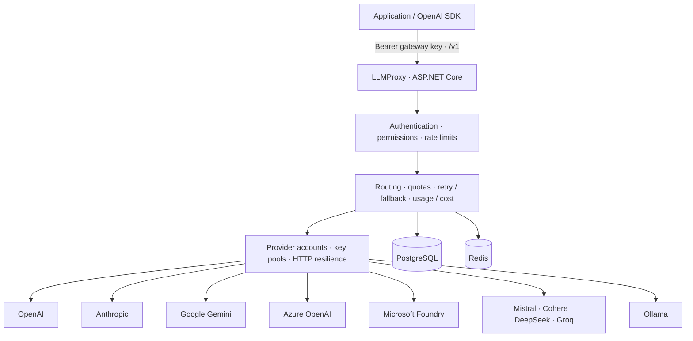

# LLMProxy

[](https://github.com/Mo7ammedd/LLMProxy/actions/workflows/ci.yml)
[](https://github.com/Mo7ammedd/LLMProxy/releases/latest)
[](https://hub.docker.com/r/mohammedtv/llmproxy)
[](LICENSE)

LLMProxy is an MIT-licensed, self-hosted LLM gateway built with C# and .NET 10. Applications connect through OpenAI-compatible HTTP APIs at `http://localhost:4000/v1`, authenticate with gateway keys and select public model aliases. The gateway owns upstream credentials, routing, concurrency, quota enforcement and usage accounting.

Version **0.3.0** is available on [Docker Hub](https://hub.docker.com/r/mohammedtv/llmproxy) as `mohammedtv/llmproxy:0.3.0` for `linux/amd64` and `linux/arm64`. This README documents that version's gateway features. PostgreSQL plus Redis supports multiple replicas; SQLite supports a persistent standalone deployment. See the [changelog and upgrade notes](CHANGELOG.md) and [image tags, signatures, SBOMs and release process](docs/releases.md) for versioned deployments and GHCR images.

[Quick start](#quick-start-with-docker) · [Provider compatibility](#provider-compatibility) · [Multiple upstream keys](#multiple-keys-per-provider) · [SDK examples](#openai-sdk-usage) · [Administration](#gateway-keys-and-administration) · [Configuration reference](docs/configuration.md) · [OpenAPI](docs/openapi.yaml) · [Releases](https://github.com/Mo7ammedd/LLMProxy/releases)

## Features

| Area | Implemented behavior |
| --- | --- |
| Inference | Chat Completions with JSON or SSE responses, function tools/results, structured output, embeddings and native stateless Responses on compatible adapters |
| Media and reasoning | Image/audio chat input, Responses image input, reasoning effort and thinking budgets where the adapter and configured model support them |
| Provider credentials | Ten adapters, named accounts, up to 64 keys per account, automatic key rotation/failover, cooldowns and separate circuit breakers |
| Routing | Capability and parameter-combination checks, model aliases, six selection strategies, provider fallback and explicit validated catalog reload |
| Admission | Per-key/owner/model RPM limits; global/key/model/provider concurrency; atomic lifetime and UTC monthly token/USD allowances |
| Key lifecycle | Model permissions, expiry, disabling and rotation with optional grace while retaining IDs, policies, consumption and batch ownership |
| Billing | Configurable ordinary/cache/tier prices, individual HTTP attempts, credential fingerprints and idempotent invoice reconciliation |
| Batch processing | Durable files and batches, database worker claims, cancellation, expiry, partial results and explicit interrupted-item outcomes |
| Management | Embedded `/admin` dashboard, local administrator/operator/auditor roles, expiring sessions, audit, usage charts, cursor pages, filters and CSV export |
| Operations | SQLite/PostgreSQL migrations, Redis admission controls, retention, health/readiness, operational alerts, graceful shutdown, OpenTelemetry, backup/recovery tools and signed/scanned container CI |

The gateway implements a documented subset of the OpenAI API. Model access, feature support and upstream billing depend on your provider account and deployment. See [compatibility boundaries](#compatibility-boundaries) before integrating additional SDK methods.

## Provider compatibility

All ten adapters support nonstreaming and SSE **Chat Completions**, function tools and tool results. The table shows adapter support; `ProviderCapabilities` and the selected upstream model can restrict it further. Named accounts inherit their adapter's capabilities.

| Adapter / routing ID | JSON output | Embeddings | Responses | Media input | Reasoning control |
| --- | --- | --- | --- | --- | --- |
| OpenAI / `openai` | Object, schema | Yes | Yes | Image, audio | `reasoning_effort` |
| Anthropic / `anthropic` | Not exposed through `response_format` | No | No | Image | `thinking_budget_tokens` |
| Google Gemini / `gemini` | Object, schema | No | No | Image, audio | `thinking_budget_tokens` |
| Azure OpenAI / `azure` | Object, schema | Yes | No | Image, audio | `reasoning_effort` |
| Microsoft Foundry / `foundry` | Object, schema | Yes | Yes | Image, audio | `reasoning_effort` |
| Mistral / `mistral` | Object, schema | Yes | No | Image | Model defaults |
| Cohere / `cohere` | Object, schema; cannot combine with tools | No | No | Text only | Model defaults |
| DeepSeek / `deepseek` | Object | No | No | Text only | Model defaults; reasoning history preserved |
| Groq / `groq` | Object, schema | No | No | Image | `reasoning_effort` |
| Ollama / `ollama` | Object, schema | Yes | No | Image | Model defaults |

Tool strictness, forced tool choice, parallel tool controls, message names and sampling ranges vary by adapter. Anthropic thinking plus tools is excluded because this adapter does not retain thinking signatures. [Detailed compatibility matrix](docs/api.md#compatibility) · [Provider setup and translations](docs/providers.md).

## Architecture



```text
src/
  LLMProxy.Domain          Entities, contracts, provider-neutral chat types
  LLMProxy.Application     Authentication, validation, routing, orchestration, accounting
  LLMProxy.Infrastructure  EF Core, migrations, PostgreSQL/SQLite, Redis
  LLMProxy.Providers       Independent provider adapters and HTTP resilience
  LLMProxy.Api             HTTP endpoints, auth handlers, errors, SSE, health
  LLMProxy.Server          Configuration, observability, CLI, application bootstrap
```

The application layer depends on provider and storage interfaces, never on EF Core or a concrete provider. [Architecture details](docs/architecture.md).

## Quick start with Docker

Create a local `.env` file containing at least one provider credential:

```dotenv
OPENAI_API_KEY=your-provider-key
```

Pull the public image and run it with standalone SQLite storage:

```bash
docker pull mohammedtv/llmproxy:0.3.0
docker run -d \
  --name llmproxy \
  --restart unless-stopped \
  -p 4000:4000 \
  --env-file .env \
  -v llmproxy-data:/data \
  mohammedtv/llmproxy:0.3.0

docker exec llmproxy dotnet LLMProxy.Server.dll keys create \
  --owner my-app --models fast,reasoning,embeddings --rpm 60
```

The command returns a JSON object containing a **one-time gateway key**, beginning with `llmp_sk_`. Store it securely and supply it to your applications. Never give applications the provider credential.

```bash
export LLMPROXY_API_KEY='the-key-returned-by-keys-create'
curl http://localhost:4000/v1/models \
  -H "Authorization: Bearer $LLMPROXY_API_KEY"
```

The client base URL is **`http://localhost:4000/v1`**. The volume preserves keys, usage and quotas in standalone mode. Use Compose or external PostgreSQL/Redis before scaling to multiple instances. Both supported architectures use the same image name; Docker selects the matching platform.

To build your own image, use `gh repo clone Mo7ammedd/LLMProxy`, select the desired branch/tag, then run `docker build -t llmproxy:local .` from the checkout. Substitute `llmproxy:local` in the run command.

GHCR images are also distributed through `ghcr.io/mo7ammedd/llmproxy`. If the package is private, authenticate with a GitHub token with `read:packages` and repository access:

```bash
printf '%s' "$GHCR_TOKEN" | docker login ghcr.io -u YOUR_GITHUB_USERNAME --password-stdin
```

## Docker Compose deployment

```bash
gh repo clone Mo7ammedd/LLMProxy
cd LLMProxy
cp .env.example .env
# Edit .env: set provider credentials and separate POSTGRES_PASSWORD / REDIS_PASSWORD values.
# Keep LLMPROXY_IMAGE=mohammedtv/llmproxy:0.3.0 to run the published release.
docker compose pull
docker compose up -d --no-build
docker compose exec llmproxy dotnet LLMProxy.Server.dll keys create \
  --owner my-app --models fast,reasoning,embeddings --rpm 60 \
  --monthly-token-limit 1000000 --monthly-budget 20
curl http://localhost:4000/health/ready
```

Compose runs the gateway, PostgreSQL 16 and Redis 7 on a dedicated network. Only the gateway port is published. PostgreSQL and Redis data use named volumes; services restart automatically and dependencies have health checks. The gateway runs as a non-root user with a read-only root filesystem.

The Compose file and `.env.example` default to `mohammedtv/llmproxy:0.3.0`. Set `LLMPROXY_IMAGE` to another published tag or digest to select a different build. To build the current checkout, set `LLMPROXY_IMAGE=llmproxy:local` and run `docker compose up -d --build`. To stop services while retaining data, use `docker compose down`. Adding `--volumes` deletes the persisted databases. Read the [upgrade notes](CHANGELOG.md#upgrading-from-020) before updating an existing database.

## Running from source

Install the .NET 10 SDK and run these commands from the desired checkout:

```bash
dotnet restore --locked-mode
dotnet build --configuration Release --no-restore -m:1
export OPENAI_API_KEY='your-provider-key'
dotnet run --project src/LLMProxy.Server --configuration Release --no-build
```

The development default uses SQLite at `src/LLMProxy.Server/data/llmproxy.db`. In a second terminal, from the repository root:

```bash
dotnet run --project src/LLMProxy.Server --configuration Release --no-build -- \
  keys create --owner developer --models fast,reasoning,embeddings
```

To use PostgreSQL and Redis from source, supply `LLMProxy__Storage__Mode=PostgreSql`, `ConnectionStrings__Postgres` and `ConnectionStrings__Redis`. A `.env` file is **not automatically loaded by `dotnet run`**. Export the relevant values or use a configured .NET secret provider. Compose reads `.env` for interpolation and forwards only variables explicitly listed in the service definition.

## Configuration and provider setup

Configuration is strongly typed and validated at startup. Environment variables use .NET's `__` separator. Administrators can reload models, capabilities, pricing, provider accounts and key pools through `POST /admin/config/reload`; process settings require restart. The defaults are in [appsettings.json](src/LLMProxy.Server/appsettings.json). Use the [configuration reference](docs/configuration.md) for bounds, precedence and complete JSON replacement.

| Provider | Credential environment variable | Other setup |
| --- | --- | --- |
| OpenAI | `OPENAI_API_KEY` | Upstream model access in your OpenAI project |
| Anthropic | `ANTHROPIC_API_KEY` | Model access in your Anthropic account |
| Google Gemini | `GEMINI_API_KEY` | Google AI Studio / Gemini API key |
| Azure OpenAI | `AZURE_OPENAI_API_KEY` | `AZURE_OPENAI_ENDPOINT`; model mappings contain **deployment names** |
| Microsoft Foundry | `FOUNDRY_API_KEY`, or `FOUNDRY_AUTHENTICATION=EntraId` | `FOUNDRY_ENDPOINT`; OpenAI v1 resource endpoint and deployment names |
| Mistral | `MISTRAL_API_KEY` | Mistral API access |
| Cohere | `COHERE_API_KEY` | Native Cohere v2 Chat API |
| DeepSeek | `DEEPSEEK_API_KEY` | DeepSeek API access |
| Groq | `GROQ_API_KEY` | GroqCloud API access |
| Ollama | Optional `OLLAMA_API_KEY` | Explicit `OLLAMA_ENDPOINT`; pull the configured model first |

Azure OpenAI defaults to API version `2024-10-21`; override `AZURE_OPENAI_API_VERSION` as required. Foundry uses `/openai/v1` without that version parameter. Provider URLs require HTTPS by default and never include credentials in query strings. Unconfigured providers are skipped. Only usable model aliases are advertised by `/v1/models`.

| Default alias | Targets | Default behavior |
| --- | --- | --- |
| `fast` | All ten adapters | Priority routing with fallback; capability checks remove incompatible targets |
| `reasoning` | OpenAI, Anthropic, Foundry, DeepSeek | Priority routing with model-specific reasoning capabilities |
| `embeddings` | OpenAI, Mistral, Ollama | Priority routing; fallback disabled to avoid mixing vector spaces |

Foundry defaults expect deployments named `gpt-4o-mini` and `gpt-5`. Ollama defaults expect `llama3.1:8b` for chat and `nomic-embed-text` for embeddings. Change mappings, capabilities and prices to match deployed models. For a persistent vector index, pin an embedding alias to one model/account. [Foundry identity setup](docs/providers.md#microsoft-foundry) · [Ollama and Docker networking](docs/providers.md#ollama).

### Multiple keys per provider

Every API-key adapter supports an `ApiKeys` array. For example, one OpenAI provider can use three credentials:

```dotenv
LLMProxy__Providers__OpenAI__ApiKeys__0=provider-key-1
LLMProxy__Providers__OpenAI__ApiKeys__1=provider-key-2
LLMProxy__Providers__OpenAI__ApiKeys__2=provider-key-3
LLMProxy__Providers__OpenAI__ApiKeyCooldownSeconds=30
```

Supply these through exported variables, `docker run --env-file` or your configuration provider. For Compose, explicitly forward them in a local `compose.override.yml`; for two keys:

```yaml
services:
  llmproxy:
    environment:
      LLMProxy__Providers__OpenAI__ApiKeys__0: "${OPENAI_POOL_KEY_1:?Set OPENAI_POOL_KEY_1}"
      LLMProxy__Providers__OpenAI__ApiKeys__1: "${OPENAI_POOL_KEY_2:?Set OPENAI_POOL_KEY_2}"
```

Set `OPENAI_POOL_KEY_1` and `OPENAI_POOL_KEY_2` in the local `.env` when using that override. A nonempty list replaces the single `ApiKey`/`OPENAI_API_KEY`; it does not append that key. With no list, existing single-key configuration works unchanged. Lists are limited to 64 distinct, nonempty credentials.

Requests rotate among available keys. HTTP 401/403 or 429 switches to another key and cools the affected key for 30 seconds by default; a longer `Retry-After` is honored up to 24 hours. Pooled 429 responses skip same-key retries. Transient HTTP/network failures retain bounded retries before key failover. Each credential has a separate circuit; the account's concurrency limit, prices and model mappings are shared. Pools apply to every supported operation, including batch items. A successful response or stream remains on its selected key.

Rotation and cooldowns use Redis in PostgreSQL mode and local memory in standalone mode. Reload preserves rotation and existing cooldowns; in-flight routes keep their captured credentials. Attempt reports identify credentials by `provider_key_id`, a fingerprint that does not contain the raw key. [Pool behavior, limits and error codes](docs/configuration.md#multiple-api-keys).

### Named provider accounts

Use named accounts for separate endpoints, pricing or concurrency scopes under the same adapter:

```dotenv
LLMProxy__Providers__Accounts__openai-east__Adapter=openai
LLMProxy__Providers__Accounts__openai-east__BaseUrl=https://api.openai.com/v1
LLMProxy__Providers__Accounts__openai-east__ApiKeys__0=provider-key-1
LLMProxy__Providers__Accounts__openai-east__ApiKeys__1=provider-key-2
```

Use `openai-east` in the model's `Providers` and `ProviderModels`, and `openai-east/<upstream-model>` in `Pricing`. Each account has its own HTTP client, key pool, usage label and provider concurrency scope. Account names contain 1–64 ASCII letters, digits, hyphens or underscores and cannot equal a built-in provider ID. [Complete account/model/pricing example](docs/configuration.md#named-provider-accounts).

Other operational environment variables:

| Variable | Purpose |
| --- | --- |
| `LLMPROXY_BOOTSTRAP_KEY` | Optional initial gateway key; create it with at least 32 random URL-safe characters after `llmp_sk_` |
| `LLMPROXY_BOOTSTRAP_OWNER` | Owner of the initial key, default `bootstrap` |
| `LLMPROXY_ADMIN_KEY` | Separate bootstrap administrator secret, at least 32 characters; local operator accounts remain usable when this is empty |
| `LLMProxy__Storage__Mode` | `Standalone` or `PostgreSql` |
| `ConnectionStrings__Postgres` | EF Core/Npgsql connection string in PostgreSQL mode |
| `ConnectionStrings__Redis` | Redis connection string in PostgreSQL mode |
| `ASPNETCORE_HTTP_PORTS` | Container listening port, default `4000` |
| `OTEL_EXPORTER_OTLP_ENDPOINT` | Optional collector endpoint for metrics and distributed traces |

## Gateway keys and administration

Gateway keys have an owner, enabled state, allowed models, requests-per-minute limit, optional expiry, and optional lifetime/monthly token and USD allowances. Creation, update and last-use timestamps are persisted. Keys are generated from 256 random bits; only SHA-256 hashes and a short identifying prefix are stored. Authentication compares hashes in constant time after lookup.

```bash
docker exec llmproxy dotnet LLMProxy.Server.dll keys list
docker exec llmproxy dotnet LLMProxy.Server.dll keys disable KEY_ID
```

`--token-limit` and `--budget` set lifetime allowances; `--monthly-token-limit` and `--monthly-budget` set UTC calendar-month allowances. `--expires-at` accepts an ISO 8601 timestamp. Omitting a limit means unlimited; zero denies requests that require it. A bootstrap key is inserted only if absent and is never re-enabled on restart.

Set a separate `LLMPROXY_ADMIN_KEY`, open `http://localhost:4000/admin` and use it to create the first local administrator. After verifying that account, you can remove the shared bootstrap secret on restart. The dashboard includes usage charts, reports/CSV, gateway key policies, provider key management, per-key usage/failures/cooldowns, optional access checks, operational alerts, operators, audit history and model configuration. Browser credentials stay in memory; a page refresh requires signing in again.

| Local role | Permissions |
| --- | --- |
| `auditor` | Read keys, usage, audit and models; export reports |
| `operator` | Auditor permissions plus create/update/rotate gateway keys |
| `administrator` | Operator permissions plus manage providers/operators, run provider checks, evaluate alerts, reconcile billing and reload configuration |

Passwords use salted PBKDF2-SHA256 hashes. Local bearer sessions expire after eight hours; password/role updates revoke them. Management actions and rejected requests are audited without storing credentials or request bodies. The last enabled local administrator is protected from disabling/demotion. Roles apply gateway-wide; there is no per-owner operator isolation.

| Management API | Purpose |
| --- | --- |
| `POST /admin/auth/login`, `GET /admin/auth/me`, `POST /admin/auth/logout` | Local sessions |
| `GET/POST /admin/operators`, `PUT /admin/operators/{id}` | Operator accounts and roles |
| `POST /admin/keys`, `PUT /admin/keys/{id}` | Create keys or replace their policy |
| `POST /admin/keys/{id}/rotate` | New credential, with optional `grace_seconds` up to 86,400 |
| `GET /admin/keys/page`, `GET /admin/keys/{id}/quotas` | Key metadata and monthly windows |
| `GET /admin/usage/page`, `/admin/usage/summary`, `/admin/usage/export` | Cursor pages, aggregate reports and CSV |
| `GET /admin/usage/{id}/attempts` | Per-HTTP-attempt status, key fingerprint, timing, usage and cost |
| `GET /admin/providers`, `POST /admin/providers/{provider}/keys`, `PUT /admin/providers/{provider}/keys/{keyId}` | Inspect pools; add encrypted keys; enable/disable keys |
| `POST /admin/providers/{provider}/check` | Optional credential/model access checks |
| `GET /admin/alerts`, `GET /admin/alerts/settings`, `POST /admin/alerts/{id}/acknowledge`, `POST /admin/alerts/evaluate` | Durable incidents, settings, acknowledgment and evaluation |
| `GET /admin/audit`, `GET /admin/models` | Audit history and model/capability configuration |
| `POST /admin/billing/reconcile`, `POST /admin/config/reload` | Invoice adjustments and catalog reload |

Usage reports support gateway-key ID, exact owner, UTC time range, model, provider and status filters. Page APIs use `limit` and opaque `cursor`, returning `data` and `next_cursor`; CSV covers all matching retained rows. Legacy `/admin/keys` and `/admin/usage` array responses remain available.

For example, using the bootstrap administrator credential:

```bash
curl 'http://localhost:4000/admin/usage/page?limit=100&model=fast' \
  -H "Authorization: Bearer $LLMPROXY_ADMIN_KEY"
curl -X POST http://localhost:4000/admin/config/reload \
  -H "Authorization: Bearer $LLMPROXY_ADMIN_KEY"
```

For provider keys, configure `LLMPROXY_PROVIDER_KEY_ENCRYPTION_KEY` with a persistent base64-encoded 32-byte key, then use the **Providers** tab. The database stores added credentials with AES-256-GCM; APIs show fingerprints. Configured credentials remain supported and can be disabled in the dashboard. Replicas refresh managed changes automatically. The **Alerts** tab tracks budget thresholds, error spikes, high latency and exhausted pools. [Provider operations, live checks and alerts](docs/provider-operations.md) explains settings, propagation, encryption backups and webhook delivery.

Policy updates replace the full policy. Rotation preserves the key ID, policies, counters and batch/file ownership; grace allows the immediately previous credential temporarily. [Administrative API examples](docs/api.md#administration) · [Roles, lifecycle and reporting](docs/expanded-api.md). Keep management endpoints on a trusted network.

## Inference and batch endpoints

All `/v1` endpoints require `Authorization: Bearer <gateway-key>`. Provider credentials and administrator sessions are separate from gateway keys.

| Method / path | Contract |
| --- | --- |
| `GET /v1/models` | Allowed public aliases backed by configured providers; no token charge |
| `POST /v1/chat/completions` | OpenAI Chat Completions JSON or SSE with optional final usage |
| `POST /v1/embeddings` | String/token inputs, optional dimensions, float/base64 output |
| `POST /v1/responses` | Native stateless Responses JSON/SSE on OpenAI or Foundry |
| `POST/GET /v1/files` | Upload `purpose=batch` JSONL files or list owned files |
| `GET/DELETE /v1/files/{id}`, `GET /v1/files/{id}/content` | File metadata, deletion and content download |
| `POST/GET /v1/batches`, `GET /v1/batches/{id}` | Submit, list and inspect durable batches |
| `POST /v1/batches/{id}/cancel` | Cancel pending work; already-running items finish |

The [OpenAPI 3.1 document](docs/openapi.yaml) defines request/response schemas, and the [API reference](docs/api.md) covers authentication, errors and streaming. The gateway does not expose the legacy `/v1/completions` API.

## OpenAI SDK usage

Configure the gateway URL and a gateway key. Applications continue using normal chat completions and public aliases regardless of the provider selected by routing.

### Python

```python
import os
from openai import OpenAI

client = OpenAI(
    base_url="http://localhost:4000/v1",
    api_key=os.environ["LLMPROXY_API_KEY"],
)
response = client.chat.completions.create(
    model="fast",
    messages=[{"role": "user", "content": "Hello"}],
)
print(response.choices[0].message.content)
```

Run the [complete Python example](examples/python/chat.py), including streaming:

```bash
python -m pip install -r examples/python/requirements.txt
python examples/python/chat.py
```

### JavaScript / TypeScript

```typescript
import OpenAI from "openai";

const client = new OpenAI({
  baseURL: "http://localhost:4000/v1",
  apiKey: process.env.LLMPROXY_API_KEY,
});
const response = await client.chat.completions.create({
  model: "fast",
  messages: [{ role: "user", content: "Hello" }],
});
console.log(response.choices[0].message.content);
```

With Node.js 24+, run the [TypeScript example](examples/typescript/chat.ts):

```bash
npm ci --prefix examples/typescript
node examples/typescript/chat.ts
```

### C#

Use the official `OpenAI` NuGet SDK in the consuming application:

```csharp
using System.ClientModel;
using OpenAI;
using OpenAI.Chat;

var client = new ChatClient("fast",
    new ApiKeyCredential(Environment.GetEnvironmentVariable("LLMPROXY_API_KEY")!),
    new OpenAIClientOptions { Endpoint = new Uri("http://localhost:4000/v1") });

ChatCompletion response = await client.CompleteChatAsync(
    [new UserChatMessage("Hello")]);
Console.WriteLine(response.Content[0].Text);
```

Run the [C# example](examples/csharp/Program.cs) with `dotnet run --project examples/csharp`. SDK dependencies belong to clients; they are not required to deploy the gateway.

### cURL and raw HTTP

```bash
curl http://localhost:4000/v1/chat/completions \
  -H "Authorization: Bearer $LLMPROXY_API_KEY" \
  -H 'Content-Type: application/json' \
  -d '{"model":"fast","messages":[{"role":"user","content":"Hello"}]}'

curl -N http://localhost:4000/v1/chat/completions \
  -H "Authorization: Bearer $LLMPROXY_API_KEY" \
  -H 'Content-Type: application/json' \
  -d '{"model":"fast","messages":[{"role":"user","content":"Hello"}],"stream":true,"stream_options":{"include_usage":true}}'
```

[Raw HTTP request collection](examples/http/chat.http) · [OpenAPI document](docs/openapi.yaml) · [API reference](docs/api.md).

### Embeddings, Responses and batches

```python
vectors = client.embeddings.create(model="embeddings", input=["A document to index"])
response = client.responses.create(model="fast", input="Hello", store=False)
print(response.output_text)
```

Use a gateway key that permits `fast` and `embeddings`, and configure compatible targets for each operation. Responses requires explicit conversation input: `store:false` is enforced, and stored/background responses, `previous_response_id`, hosted tools and provider file references are rejected. Native Responses SSE uses events such as `response.output_text.delta` and `response.completed`, without the Chat Completions `[DONE]` marker.

Batch files contain JSONL lines with a unique `custom_id`, `method:"POST"`, a supported `url` and a nonstreaming `body`. Chat completions, embeddings and Responses can run as batches. Jobs are scoped to gateway key IDs, use a `24h` admission window, and persist worker claims/results in the database. Defaults are 10 MiB per file, 1,000 requests and four workers per process. Set `LLMProxy__Batches__Workers=0` on API-only replicas.

Gateway batches use ordinary provider pricing and per-item admission/accounting. Cancellation stops pending work; running items can finish, and partial results remain downloadable. A lost worker's uncertain running item becomes `batch_item_interrupted` and is not automatically replayed. Batch request/response contents are intentionally stored in the database and backups; download required results before retention removes them.

See [Python protocols and batch example](examples/python/protocols.py), [TypeScript protocols example](examples/typescript/protocols.ts) and the [extended API guide](docs/expanded-api.md).

### Media and reasoning

Chat user content arrays accept `text`, `image_url` and `input_audio`. Images use HTTPS URLs or PNG/JPEG/WebP/GIF base64 data URLs; audio uses base64 WAV/MP3. The gateway translates media for compatible adapters, subject to target capability declarations and request limits.

`reasoning_effort` accepts `none`, `minimal`, `low`, `medium`, `high` and `xhigh`; each model supports a subset. `thinking_budget_tokens` maps to Anthropic/Gemini, must be at least 1,024 and below the total output limit, and cannot be combined with `reasoning_effort`. Use the SDK's extra-body mechanism for gateway-specific fields. [Media/reasoning examples and restrictions](docs/expanded-api.md#chat-media-and-reasoning-controls).

## Model routing and pricing

Use aliases to decouple applications from provider model names:

```json
{
  "LLMProxy": {
    "Models": {
      "balanced-chat": {
        "Providers": ["openai", "anthropic", "gemini"],
        "ProviderModels": {
          "openai": "gpt-4o-mini",
          "anthropic": "claude-haiku-4-5-20251001",
          "gemini": "gemini-2.5-flash"
        },
        "Routing": "round-robin",
        "EnableFallback": true,
        "RequestsPerMinute": 600,
        "MaxOutputTokens": 4096,
        "MaxConcurrentRequests": 100
      }
    }
  }
}
```

This excerpt adds a new alias; retain its corresponding `Pricing` entries from the full configuration and grant the alias to the calling gateway key. When replacing existing arrays or removing defaults, use a [complete JSON replacement](docs/configuration.md#complete-json-replacement): .NET configuration merges array indexes across sources.

| Strategy | Selection behavior |
| --- | --- |
| `priority` | Configuration order; remaining targets are available when fallback is enabled |
| `fallback` | Configuration order with fallback always enabled |
| `round-robin` | Rotating provider order, using Redis cursors in PostgreSQL mode |
| `random` | Random target order without replacement |
| `cost` | Lowest estimated request cost, using captured prices and input-size tiers |
| `latency` | Lowest recent process-local provider/model latency observation |

Adapter/model capabilities and known parameter combinations exclude incompatible targets before selection and quota reservation. Optional target context bounds use conservative serialized-byte input estimates. No compatible target returns `unsupported_model_capability` (400); configuration validation does not remotely verify credentials or model access.

Retries use `Microsoft.Extensions.Http.Resilience`; provider fallback uses Polly. HTTP 429/408, temporary 5xx failures, timeouts and connection failures are eligible. HTTP 400/422 requests are not replayed. A multi-key pool can try another credential after 401/403 and then another provider if exhausted; a single-key authentication failure stops immediately. Model `EnableFallback` controls provider changes independently of key-pool failover.

The gateway fetches the first streaming event before committing HTTP 200. After any event is emitted, including a Responses lifecycle event, it never restarts or switches providers. Midstream failures produce sanitized error events and no successful termination marker. Client disconnects cancel upstream work.

### Quotas, pricing and reconciliation

Pricing is configured per `provider/upstream-model`, in USD per million input/output tokens, with optional cache rates and input-size tiers. Named accounts use their account name in the price key. Escape `:` as `%3A` and literal `%` as `%25`; for example, `ollama/llama3.1%3A8b` prices `llama3.1:8b`. Keep the original model name in `ProviderModels`. Included prices are **editable estimates**, not a current pricing feed or billing guarantee. Verify provider rates and use recorded attempts for invoice reconciliation. [Accounting semantics](docs/architecture.md#accounting-and-failure-recovery).

Before calling an upstream, the gateway atomically reserves lifetime and monthly token/USD allowances using the most expensive compatible route estimate. Completion settles once, releases the reservation and retains every HTTP retry/key/provider attempt. Requests crossing a UTC month boundary settle against their original month. Key policy changes and report retention do not erase consumption counters.

Missing final usage is estimated. Cancelled/timed-out requests and incomplete streams can be charged conservatively up to their reserved token ceiling; abandoned reservations are recovered exactly once. Provider retries can incur additional real charges even when no final usage arrives. `POST /admin/billing/reconcile` accepts explicit attempt IDs, actual costs and unique invoice references, adjusting request and original-month/lifetime spending idempotently. It does not fetch or parse provider invoices automatically.

### Configuration reload

An administrator calls `POST /admin/config/reload` after editing a mounted configuration source. Models, capability declarations, prices, accounts and key pools are validated together and atomically published; invalid configuration preserves the previous catalog. In-flight routes retain their provider objects and prices.

Reload each replica separately. Storage, listeners, bootstrap/admin secrets, worker counts, retention, HTTP resilience and global admission settings require a process restart. Editing a deployment's environment does not change the environment of an already-running process.

## Production deployment

Common defaults, relative to `LLMProxy` unless otherwise noted:

| Setting | Default |
| --- | --- |
| `Requests:MaxBodyBytes` / `MaxMessages` | 1 MiB / 256 messages |
| `Requests:DefaultMaxOutputTokens` | 1,024, bounded by the selected alias's maximum |
| `Requests:TimeoutSeconds` / `ReservationTtlSeconds` | 180 seconds / 600 seconds |
| `Providers:Resilience:RetryCount` | 2 additional HTTP attempts per selected key; pooled 429s switch keys immediately |
| `Providers:Resilience:AttemptTimeoutSeconds` / `TotalTimeoutSeconds` | 30 seconds per HTTP attempt / 100 seconds per selected key's HTTP pipeline |
| `Concurrency:GlobalLimit` / `PerKeyLimit` / `PerProviderLimit` | 1,000 / 20 / 100 |
| `Models:<alias>:MaxConcurrentRequests` | 100 |
| Gateway key / owner / model RPM | 60 per new key / 300 per owner / 600 per alias |
| `Storage:UsageRetentionDays` / `AuditRetentionDays` / `BatchRetentionDays` | 90 / 365 / 7 days |

The application deadline bounds all key retries, provider fallback and streaming. Concurrency leases use Redis in PostgreSQL mode and local state in standalone mode. Leases expire after the request deadline plus 60 seconds if a process dies; normal completion releases them. Redis outages fail admission closed. Retention prunes reporting rows and expired batch contents while preserving key/monthly consumption totals and reconciliation receipts.

- Use PostgreSQL and Redis with backups, private networking and authenticated connections. Share configuration and Redis key prefix across replicas.
- Terminate TLS at a trusted reverse proxy or configure Kestrel certificates. Configure explicit CORS origins and trusted proxy IPs when needed.
- Disable response buffering for SSE, use proxy timeouts longer than the gateway request deadline, and preserve `Authorization` and correlation headers.
- Pin an image version or digest; keep provider and gateway credentials in a secret manager. Never commit `.env` files.
- Configure output-token bounds and key allowances. Concurrent requests reserve quota atomically before contacting a provider.
- Review migration and retention policies. Automatic migrations are convenient for initial deployment; larger installations can run `migrate` separately and disable `AutoMigrate` on server instances.

`/health/live` checks the process. `/health` and `/health/ready` report database, Redis, provider configuration and shutdown state. Provider outages do not make the process unhealthy. A partially configured alias set is degraded but ready; unavailable aliases are not advertised. No readiness/liveness check calls an LLM API. Administrators can separately enable and run live provider checks.

Logs contain identifiers, model/provider names, status, latency and token counts, never prompts, message bodies or keys by default. Set `OTEL_EXPORTER_OTLP_ENDPOINT` to export traces and metrics. [Operations, TLS, metrics and backups](docs/operations.md).

The `migrate` CLI applies pending SQLite or PostgreSQL migrations without starting the HTTP server. `reservations recover` settles expired reservations; `healthcheck` provides the container liveness probe. The runtime allows 45 seconds for graceful shutdown, with 60 seconds granted by Compose. Batch input/output is an explicit exception to body-free usage logging: its contents are stored for later execution/download and must be included in backup and retention planning.

## Compatibility boundaries

- Responses is stateless and available through OpenAI/Foundry. Stored responses, conversations, background execution, hosted tools and upstream provider file references are rejected.
- Files exist for gateway batches. There is no general provider file upload, native provider batch API or automatic native batch discount.
- Image generation, speech generation/transcription, video, log probabilities and legacy Completions are not exposed.
- Operators use local identities with gateway-wide roles. OIDC/SSO, MFA and owner-scoped operator permissions are not implemented.
- Latency-routing measurements remain process-local. Provider/model rotation, key cooldowns and admission limits use Redis in PostgreSQL mode. Managed key changes propagate automatically; file/environment configuration reload remains per replica.
- Model capability and price catalogs are operator-configured. Health checks and automated provider tests do not establish access to every live model or its current price.

See the [remaining roadmap](docs/roadmap.md) for follow-up work and [detailed protocol boundaries](docs/api.md#compatibility) for parameter-level differences.

## Container registries and releases

[GitHub Actions](.github/workflows/ci.yml) builds and tests the solution, exercises real PostgreSQL/Redis, runs a two-instance load/recovery/backup drill, and builds and runs Docker/SDK checks on native AMD64 and ARM64 runners. After these checks pass, it publishes one multi-platform build to Docker Hub and GHCR and verifies the digest and platform manifests in both registries.

| Source | Docker Hub: `mohammedtv/llmproxy` | GHCR: `ghcr.io/mo7ammedd/llmproxy` |
| --- | --- | --- |
| Successful `main` build | `latest`, `sha-<commit>` | `latest`, `sha-<commit>` |
| Stable Git tag, e.g. `v0.3.0` | `0.3.0`, `0.3`, `latest`, `sha-<commit>` | `v0.3.0`, `v0.3`, `latest`, `sha-<commit>` |
| Prerelease tag, e.g. `v0.3.0-rc.1` | `0.3.0-rc.1`, `sha-<commit>` | `v0.3.0-rc.1`, `sha-<commit>` |

Git tags use a `v` prefix; Docker Hub version tags omit it. Stable and prerelease tags create corresponding GitHub releases. Pull requests build and test without registry logins or image publication; ordinary feature-branch pushes do not trigger CI. Manual workflow runs can publish the selected ref, so use pull requests for validation alone. `latest` tracks successful `main` builds as well as stable releases; use a full version or digest for a pinned deployment.

Version `0.3.0` on Docker Hub is pinned to the previously verified build of commit `1911fc8`. The automated Docker Hub workflow applies to subsequent builds; it does not replace that existing release image. The [release guide](docs/releases.md) records its digest, explains registry credentials and describes versioning, release notes, verification and recovery from failed publication.

GHCR uses the repository's `GITHUB_TOKEN`; Docker Hub uses the `DOCKERHUB_USERNAME` repository variable and encrypted `DOCKERHUB_TOKEN` Actions secret. The maintained [Docker Hub overview](docs/dockerhub.md) is synchronized after successful `main` publication. Reusable NuGet packages remain a possible future distribution channel; the gateway is a standalone server today.

## Development and testing

```bash
dotnet restore --locked-mode
dotnet build --configuration Release --no-restore -m:1
dotnet test --configuration Release --no-build --no-restore
dotnet format --verify-no-changes --no-restore
```

Unit and provider tests use deterministic fakes. HTTP integration tests run an in-process server with real SQLite migrations. To include PostgreSQL and Redis tests, export these variables before running `dotnet test`:

```bash
export LLMPROXY_TEST_POSTGRES='Host=localhost;Database=postgres;Username=test_user;Password=your-test-password'
export LLMPROXY_TEST_REDIS='localhost:6379,password=your-test-password,abortConnect=false'
```

The PostgreSQL test role must be able to create databases. Tests create and delete isolated `llmproxy_tests_*` databases. These tests are skipped without their environment variables; CI always supplies both services.

For black-box source and container checks, build Release and install the example SDK dependencies first:

```bash
python -m pip install -r examples/python/requirements.txt
npm ci --prefix examples/typescript --ignore-scripts
python scripts/source_smoke.py
python scripts/source_smoke.py --provider cohere
docker build -t llmproxy:smoke .
python scripts/docker_smoke.py
```

The smoke tests exercise normal and streaming chat through the Python, TypeScript and C# OpenAI SDKs, plus Python/TypeScript embeddings and Responses and Python files/batches. `--provider` accepts `openai`, `foundry`, `mistral`, `cohere`, `deepseek`, `groq` and `ollama`. Docker tests exercise all six added adapters and verify non-root execution, health, persistent usage after restart and graceful shutdown. All automated provider calls go to mocks; Entra tests inject fake credentials and never contact Azure identity services.

`scripts/load_probe.py` measures throughput, latency and stream first-token timing. `scripts/recovery_drill.py` runs local mock traffic through two gateway processes, kills a streaming process, recovers its orphan once, exercises Redis loss and restores a PostgreSQL backup. It needs `redis-server`, PostgreSQL client tools and a test role able to create databases. [Commands and validation limits](docs/operations.md#load-and-recovery-drills).

The v0.3 local run passed **347 .NET tests** plus three vulnerability-policy tests, covering provider management, shared Redis pools, durable alerts, migrations and the existing protocols with PostgreSQL and Redis enabled. The [verification record](docs/implementation-plan.md) also lists SDK, browser, recovery and migration checks and their environment limits. Live-provider testing and successful native container CI are separate checks.

[Contributor guide](CONTRIBUTING.md) · [Security policy](SECURITY.md) · [MIT license](LICENSE).
