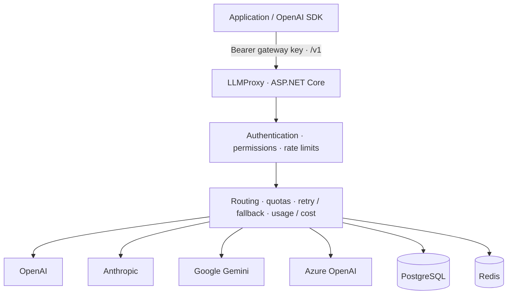

# LLMProxy

LLMProxy is an MIT-licensed, self-hosted LLM gateway built with C# and .NET 10. Deploy it once and point existing OpenAI clients at `http://localhost:4000/v1`. Applications use public model aliases; the gateway handles provider selection, credentials, retries, fallback, authentication, quotas, usage and estimated cost.

The primary distribution is `ghcr.io/mo7ammedd/llmproxy`. PostgreSQL and Redis are the recommended production deployment. A persistent SQLite standalone mode makes a one-container evaluation possible.

This initial MVP supports text chat and function tools, normal completions and SSE streaming across OpenAI, Anthropic, Google Gemini and Azure OpenAI. See the [compatibility boundaries](docs/api.md#compatibility) before moving an existing application.

## Architecture



```text
src/
  LLMProxy.Domain          Entities, contracts, provider-neutral chat types
  LLMProxy.Application     Authentication, validation, routing, orchestration, accounting
  LLMProxy.Infrastructure  EF Core, migrations, PostgreSQL/SQLite, Redis
  LLMProxy.Providers       Independent provider adapters and HTTP resilience
  LLMProxy.Api             HTTP endpoints, auth handlers, errors, SSE, health
  LLMProxy.Server          Configuration, observability, CLI, application bootstrap
```

The application layer depends on provider and storage interfaces, never on EF Core or a concrete provider. [Architecture details](docs/architecture.md).

## Quick Docker start

No source checkout is required. Create a local `.env` file containing at least one provider credential:

```dotenv
OPENAI_API_KEY=your-provider-key
```

Pull and run the gateway:

```bash
docker pull ghcr.io/mo7ammedd/llmproxy:latest
docker run -d \
  --name llmproxy \
  --restart unless-stopped \
  -p 4000:4000 \
  --env-file .env \
  -v llmproxy-data:/data \
  ghcr.io/mo7ammedd/llmproxy:latest

docker exec llmproxy dotnet LLMProxy.Server.dll keys create \
  --owner my-app --models fast --rpm 60
```

The command returns a JSON object containing a **one-time gateway key**, beginning with `llmp_sk_`. Store it securely and supply it to your applications. Never give applications the provider credential.

```bash
export LLMPROXY_API_KEY='the-key-returned-by-keys-create'
curl http://localhost:4000/v1/models \
  -H "Authorization: Bearer $LLMPROXY_API_KEY"
```

The client base URL is **`http://localhost:4000/v1`**. The volume preserves keys, usage and quotas in standalone mode. Use Compose or external PostgreSQL/Redis before scaling to multiple instances.

This repository and its initial GHCR package are private. A private image requires registry authentication first, using a GitHub token with `read:packages` and access to the repository:

```bash
printf '%s' "$GHCR_TOKEN" | docker login ghcr.io -u YOUR_GITHUB_USERNAME --password-stdin
```

## Docker Compose deployment

```bash
git clone https://github.com/Mo7ammedd/LLMProxy.git
cd LLMProxy
cp .env.example .env
# Edit .env: set provider credentials and separate POSTGRES_PASSWORD / REDIS_PASSWORD values.
docker compose up -d
docker compose exec llmproxy dotnet LLMProxy.Server.dll keys create \
  --owner my-app --models fast,reasoning --rpm 60 --token-limit 1000000 --budget 20
curl http://localhost:4000/health/ready
```

Compose runs the gateway, PostgreSQL 16 and Redis 7 on a dedicated network. Only the gateway port is published. PostgreSQL and Redis data use named volumes; services restart automatically and dependencies have health checks. The gateway runs as a non-root user with a read-only root filesystem.

To build the image from your checkout, use `docker compose up -d --build`. To stop services while retaining data, use `docker compose down`. Adding `--volumes` deletes the persisted databases.

## Running from source

Install the .NET 10 SDK:

```bash
git clone https://github.com/Mo7ammedd/LLMProxy.git
cd LLMProxy
dotnet restore
dotnet build
export OPENAI_API_KEY='your-provider-key'
dotnet run --project src/LLMProxy.Server
```

The development default uses SQLite at `src/LLMProxy.Server/data/llmproxy.db`. In a second terminal, from the repository root:

```bash
dotnet run --project src/LLMProxy.Server -- keys create --owner developer --models fast
```

To use PostgreSQL and Redis from source, supply `LLMProxy__Storage__Mode=PostgreSql`, `ConnectionStrings__Postgres` and `ConnectionStrings__Redis`. A `.env` file is read by Docker/Compose, **not automatically by `dotnet run`**. Export the relevant values or use .NET user secrets / a secret-backed configuration provider.

## Configuration and provider setup

Configuration is strongly typed and read at startup. Environment variables use .NET's `__` separator. Restart the gateway after changing configuration. The default configuration is in [appsettings.json](src/LLMProxy.Server/appsettings.json); the [configuration reference](docs/configuration.md) documents every supported setting.

| Provider | Credential environment variable | Other setup |
| --- | --- | --- |
| OpenAI | `OPENAI_API_KEY` | Upstream model access in your OpenAI project |
| Anthropic | `ANTHROPIC_API_KEY` | Model access in your Anthropic account |
| Google Gemini | `GEMINI_API_KEY` | Google AI Studio / Gemini API key |
| Azure OpenAI | `AZURE_OPENAI_API_KEY` | `AZURE_OPENAI_ENDPOINT`; model mappings contain **deployment names** |

Azure defaults to API version `2024-10-21`; override `AZURE_OPENAI_API_VERSION` as required. Provider base URLs are configurable, require HTTPS by default and never include credentials in query strings. Providers with missing credentials are skipped. Only usable model aliases are advertised by `/v1/models`.

Other operational environment variables:

| Variable | Purpose |
| --- | --- |
| `LLMPROXY_BOOTSTRAP_KEY` | Optional initial gateway key; create it with at least 32 random URL-safe characters after `llmp_sk_` |
| `LLMPROXY_BOOTSTRAP_OWNER` | Owner of the initial key, default `bootstrap` |
| `LLMPROXY_ADMIN_KEY` | Separate management API secret, at least 32 characters; management HTTP API is disabled when empty |
| `LLMProxy__Storage__Mode` | `Standalone` or `PostgreSql` |
| `ConnectionStrings__Postgres` | EF Core/Npgsql connection string in PostgreSQL mode |
| `ConnectionStrings__Redis` | Redis connection string in PostgreSQL mode |
| `ASPNETCORE_HTTP_PORTS` | Container listening port, default `4000` |
| `OTEL_EXPORTER_OTLP_ENDPOINT` | Optional collector endpoint for metrics and distributed traces |

## API key management

Gateway keys have an owner, enabled state, allowed models, requests-per-minute limit, optional lifetime token limit and optional lifetime USD spending budget. Creation, update and last-use timestamps are persisted. Keys are generated from 256 random bits; only SHA-256 hashes and a short identifying prefix are stored. Authentication compares hashes in constant time after lookup.

```bash
docker exec llmproxy dotnet LLMProxy.Server.dll keys list
docker exec llmproxy dotnet LLMProxy.Server.dll keys disable KEY_ID
```

`--token-limit` and `--budget` are lifetime allowances, not monthly resets. Omitting either means unlimited; zero denies requests that require that allowance. A bootstrap key is inserted only if absent and is never re-enabled on restart.

For automation, set a separate `LLMPROXY_ADMIN_KEY` and use `POST /admin/keys`, `GET /admin/keys`, `PUT /admin/keys/{id}` and `GET /admin/usage`. [Administrative API examples](docs/api.md#administration). Keep the management endpoints on a trusted network.

## OpenAI SDK usage

Configure the gateway URL and a gateway key. Applications continue using normal chat completions and public aliases regardless of the provider selected by routing.

### Python

```python
import os
from openai import OpenAI

client = OpenAI(
    base_url="http://localhost:4000/v1",
    api_key=os.environ["LLMPROXY_API_KEY"],
)
response = client.chat.completions.create(
    model="fast",
    messages=[{"role": "user", "content": "Hello"}],
)
print(response.choices[0].message.content)
```

Run the [complete Python example](examples/python/chat.py), including streaming:

```bash
python -m pip install -r examples/python/requirements.txt
python examples/python/chat.py
```

### JavaScript / TypeScript

```typescript
import OpenAI from "openai";

const client = new OpenAI({
  baseURL: "http://localhost:4000/v1",
  apiKey: process.env.LLMPROXY_API_KEY,
});
const response = await client.chat.completions.create({
  model: "fast",
  messages: [{ role: "user", content: "Hello" }],
});
console.log(response.choices[0].message.content);
```

With Node.js 24+, run the [TypeScript example](examples/typescript/chat.ts):

```bash
npm ci --prefix examples/typescript
node examples/typescript/chat.ts
```

### C#

Use the official `OpenAI` NuGet SDK in the consuming application:

```csharp
using System.ClientModel;
using OpenAI;
using OpenAI.Chat;

var client = new ChatClient("fast",
    new ApiKeyCredential(Environment.GetEnvironmentVariable("LLMPROXY_API_KEY")!),
    new OpenAIClientOptions { Endpoint = new Uri("http://localhost:4000/v1") });

ChatCompletion response = await client.CompleteChatAsync(
    [new UserChatMessage("Hello")]);
Console.WriteLine(response.Content[0].Text);
```

Run the [C# example](examples/csharp/Program.cs) with `dotnet run --project examples/csharp`. SDK dependencies belong to clients; they are not required to deploy the gateway.

### cURL and raw HTTP

```bash
curl http://localhost:4000/v1/chat/completions \
  -H "Authorization: Bearer $LLMPROXY_API_KEY" \
  -H 'Content-Type: application/json' \
  -d '{"model":"fast","messages":[{"role":"user","content":"Hello"}]}'

curl -N http://localhost:4000/v1/chat/completions \
  -H "Authorization: Bearer $LLMPROXY_API_KEY" \
  -H 'Content-Type: application/json' \
  -d '{"model":"fast","messages":[{"role":"user","content":"Hello"}],"stream":true,"stream_options":{"include_usage":true}}'
```

[Raw HTTP request collection](examples/http/chat.http) · [OpenAPI document](docs/openapi.yaml) · [API reference](docs/api.md).

## Model routing and pricing

Use aliases to decouple applications from provider model names:

```json
{
  "LLMProxy": {
    "Models": {
      "fast": {
        "Providers": ["openai", "anthropic", "gemini"],
        "ProviderModels": {
          "openai": "gpt-4o-mini",
          "anthropic": "claude-haiku-4-5-20251001",
          "gemini": "gemini-2.5-flash"
        },
        "Routing": "round-robin",
        "EnableFallback": true,
        "RequestsPerMinute": 600,
        "MaxOutputTokens": 4096
      }
    }
  }
}
```

This is a configuration excerpt; retain the corresponding `Pricing` entries from the full configuration. Supported strategies are `priority`, `round-robin`, `random` and `fallback`. Normal strategies honor `EnableFallback`; the explicit `fallback` strategy always tries remaining candidates after a transient failure. Round-robin cursors are shared through Redis in PostgreSQL mode.

Retries use `Microsoft.Extensions.Http.Resilience`; provider fallback uses Polly resilience pipelines. HTTP 429, 408, temporary 5xx failures, timeouts and connection failures are eligible. Client errors and upstream credential failures are not retried. Streaming never falls back or restarts after an event has been emitted.

Pricing is configured per `provider/upstream-model`, in USD per million input/output tokens. The included prices are **editable estimates**, not a current pricing feed or billing guarantee. Verify rates, model availability, caching discounts and long-context tiers with your providers. [Accounting semantics](docs/architecture.md#accounting-and-failure-recovery).

## Production deployment

- Use PostgreSQL and Redis with backups, private networking and authenticated connections. Share configuration and Redis key prefix across replicas.
- Terminate TLS at a trusted reverse proxy or configure Kestrel certificates. Configure explicit CORS origins and trusted proxy IPs when needed.
- Disable response buffering for SSE, use proxy timeouts longer than the gateway request deadline, and preserve `Authorization` and correlation headers.
- Pin an image version or digest; keep provider and gateway credentials in a secret manager. Never commit `.env` files.
- Configure output-token bounds and key allowances. Concurrent requests reserve quota atomically before contacting a provider.
- Review migration and retention policies. Automatic migrations are convenient for initial deployment; larger installations can run `migrate` separately and disable `AutoMigrate` on server instances.

`/health/live` checks the process. `/health` and `/health/ready` report database, Redis, provider configuration and shutdown state. Provider outages do not make the process unhealthy. A partially configured alias set is degraded but ready; unavailable aliases are not advertised. No health check calls a real LLM API.

Logs contain identifiers, model/provider names, status, latency and token counts, never prompts, message bodies or keys by default. Set `OTEL_EXPORTER_OTLP_ENDPOINT` to export traces and metrics. [Operations, TLS, metrics and backups](docs/operations.md).

## GitHub Container Registry and releases

[GitHub Actions](.github/workflows/ci.yml) builds and tests the solution, exercises real PostgreSQL/Redis, builds the production image, and runs Docker and three OpenAI SDK smoke tests against a mock provider. Publication runs only after these checks pass.

- Successful `main` builds publish `latest` and `sha-<commit>`.
- A stable tag such as `v1.0.0` publishes `v1.0.0`, `v1.0`, `latest` and a GitHub release.
- Prerelease tags publish their version without moving `latest`.
- Pull requests build and test without pushing an image.
- Images target `linux/amd64` and `linux/arm64`; runtime Docker tests execute on amd64.

To cut a release after review:

```bash
git tag v1.0.0
git push origin v1.0.0
```

The workflow uses the repository's `GITHUB_TOKEN` with package-write permission. No registry password needs to be committed. Package visibility remains private unless an owner changes it. Reusable NuGet packages are a possible future distribution channel; the gateway is a standalone server today.

## Development and testing

```bash
dotnet restore --locked-mode
dotnet build --configuration Release --no-restore
dotnet test --configuration Release --no-build
dotnet format --verify-no-changes --no-restore
```

Unit and provider tests use deterministic fakes. HTTP integration tests run an in-process server with real SQLite migrations. To include PostgreSQL and Redis tests, set:

```dotenv
LLMPROXY_TEST_POSTGRES=Host=localhost;Database=postgres;Username=test_user;Password=your-test-password
LLMPROXY_TEST_REDIS=localhost:6379,password=your-test-password,abortConnect=false
```

The PostgreSQL test role must be able to create databases. Tests create and delete isolated `llmproxy_tests_*` databases. These tests are skipped without their environment variables; CI always supplies both services.

For black-box source and container checks, install the Python and TypeScript example dependencies, then run:

```bash
python scripts/source_smoke.py
docker build -t llmproxy:smoke .
python scripts/docker_smoke.py
```

The smoke tests exercise normal and streaming requests through the actual Python, TypeScript and C# OpenAI SDKs. Docker tests also verify non-root execution, health, persistent usage after restart and graceful shutdown. All automated provider calls go to local mocks.

[Contributor guide](CONTRIBUTING.md) · [Security policy](SECURITY.md) · [MIT license](LICENSE).
