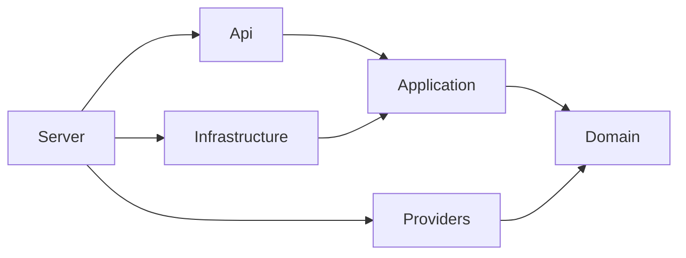

# Architecture

LLMProxy is a standalone ASP.NET Core gateway with reusable libraries. The composition root is `LLMProxy.Server`; all state needed across replicas lives in PostgreSQL and Redis. Standalone mode uses SQLite and process-local rate/cursor state for a single instance.

## Dependency direction



`Domain` contains entities, typed chat contracts, exceptions and interfaces. It references no EF Core, ASP.NET Core or provider SDK. `Application` owns policy and orchestration. `Infrastructure` implements persistence and distributed state. `Providers` translates between the common contract and provider wire protocols. `Api` owns HTTP-specific behavior, including authentication challenges, problem details and SSE framing.

Configuration objects are bound once and registered through DI. Configuration changes require a restart. There is no static mutable routing, authentication or quota state.

## Request flow

1. Generate a fresh internal request ID and validate an optional `X-Correlation-Id` header.
2. Parse the bearer key, hash it, look up its policy and compare hashes in constant time. Disabled keys fail authentication. Update `LastUsedAt` after successful authentication.
3. Validate the chat request, model alias, allowed-model policy and output-token bounds.
4. Atomically acquire key, owner and model rate-limit allowances. Denial consumes none of the other scopes.
5. Resolve available providers through the registry and chosen routing strategy.
6. Reserve tokens and estimated spending in a database transaction, conditional on the key's enabled state and remaining allowances.
7. Invoke the provider through the HTTP resilience pipeline; move to another candidate only for a classified transient failure.
8. Translate the result back to the public alias and a stable gateway completion ID.
9. Atomically commit usage, apply actual/estimated consumption and release the reservation. Return the normal response or finish the SSE stream.

`GET /v1/models` shares key and owner rate limits but does not consume token quota. It returns only permitted aliases with at least one configured provider.

## Provider and routing contracts

```csharp
public interface ILlmProvider
{
    string Name { get; }
    bool IsConfigured { get; }
    Task<LlmResponse> ChatCompletionAsync(LlmRequest request, CancellationToken cancellationToken);
    IAsyncEnumerable<LlmStreamChunk> StreamChatCompletionAsync(
        LlmRequest request, CancellationToken cancellationToken);
}
```

`IModelRouter.SelectProviderAsync` provides the simple selection contract. `IRoutePlanner` supplies the complete ordered fallback plan to orchestration. Strategies implement `IRoutingStrategy`; round-robin uses `IRoutingState`, backed by either Redis or an instance-owned concurrent dictionary. Priority preserves configuration order, random shuffles without replacement, and fallback preserves priority order while forcing fallback to remain enabled.

To add a provider:

1. Implement `ILlmProvider` in an adapter library. Translate text, tool calls, usage and finish reasons into domain types.
2. Propagate cancellation and raise sanitized `ProviderException` values, marking only transient failures retryable. Never include raw upstream error bodies in exceptions.
3. Register the adapter as `ILlmProvider` and register a named resilient HTTP client if it uses `ProviderHttpTransport`.
4. Add provider/model mappings and pricing to configuration, with contract tests against a mock endpoint.

No router, business service or HTTP endpoint needs a provider-specific branch. Additional strategies can similarly be registered as `IRoutingStrategy` without changing `ModelRouter`.

## Retry and streaming behavior

`Microsoft.Extensions.Http.Resilience` provides per-provider attempt timeouts, retry with exponential backoff/jitter, `Retry-After` handling, a circuit breaker and a total HTTP timeout. Clients are named per provider so one provider's circuit does not open another's circuit. Redirects and cookies are disabled, preventing credentials from being forwarded to redirect targets.

The application uses a Polly resilience pipeline for provider fallback. HTTP 429, HTTP 408, 5xx failures and connection/timeout failures are retryable. Invalid requests and provider authentication failures fail immediately. POST retries can result in additional provider charges; cross-provider exactly-once billing cannot be guaranteed.

For streams, the application obtains the first provider event inside the fallback pipeline before committing HTTP 200. After an event is emitted, the stream is never replayed or switched to another provider. All chunks use the same public model name, ID and creation time. Usage is collected regardless of whether the client requests it, and emitted once as a final `choices: []` chunk when `include_usage` is true.

OpenAI/Azure `[DONE]`, Anthropic `message_stop` and Gemini final candidates are checked explicitly. An incomplete stream is an error. Midstream errors produce a sanitized OpenAI error event and close without a successful `[DONE]` marker. A disconnected client cancels upstream work; cleanup uses an independent bounded cancellation token.

## Accounting and failure recovery

`ApiKey`, `QuotaReservation` and `UsageRecord` are persistent domain entities. Tokens and spending counters are stored on the key, so pruning old usage does not reset lifetime allowances. Monetary counters use integer nano-USD; `IModelPricing` returns decimal per-token prices from configuration.

Before a request, the gateway estimates input tokens conservatively from UTF-8 bytes plus framing, adds the selected output cap, and reserves the most expensive candidate's estimated cost. This is an admission estimate, not a model-specific tokenizer. A small remaining token balance may require a lower `max_tokens` even for a short prompt.

The reservation update is one conditional SQL statement inside a transaction. PostgreSQL and SQLite tests verify that concurrent requests cannot reserve more than the available allowance. Completion claims and deletes the reservation, updates the counters and inserts usage in the same transaction. Duplicate finalizers do not charge twice. EF Core execution strategies retry database transactions with fresh contexts.

Successful responses use provider-reported token usage. Missing final usage is estimated and marked `usage_estimated`. Interrupted streams without final usage and cancelled/timed-out admitted requests are charged conservatively up to their reserved token ceiling; this prevents cancellation from bypassing budgets. A known upstream rejection with no output is recorded with zero observed token usage. Provider billing can include unsuccessful or retried attempts that the gateway cannot observe; spending budgets and request cost remain estimates.

A recovery worker checks for expired reservations every minute. If a process exits before finalization, recovery records an `abandoned` request and consumes its reserved allowance. Expiry must exceed the full request deadline and cleanup window. Operators can investigate these records before performing any manual reconciliation. Reservations are never silently refunded after a crash.

Every admitted chat request produces a durable usage record containing request/key IDs, public model, final provider, token counts, latency, status/error, estimated cost and time. Authentication, validation, rate-limit and quota-admission rejections are represented by HTTP telemetry, not completion rows. Neither usage records nor normal logs contain prompts, responses or raw keys.

## Distributed state and consistency

- API-key authentication reads current database state; it does not cache policies, so revocations apply to subsequent authentications immediately.
- Redis rate-limit scripts check every scope before incrementing any counter. Windows last 60 seconds from each scope's first accepted request.
- Redis also caches round-robin cursors with a 24-hour expiry. A common hash tag keeps multi-key Lua operations in one Redis Cluster slot.
- Redis outages fail closed with HTTP 503. The gateway never quietly switches a distributed deployment to local limits.
- Key policies already authenticated or requests already in flight are not retroactively cancelled by revocation.
- PostgreSQL/Redis deployments can scale horizontally. SQLite mode is intended for one process and uses local limits that reset on restart.

The initial design intentionally omits request-content caching, background batch queues and a management UI. These can be added behind application interfaces without changing the OpenAI-compatible surface.
