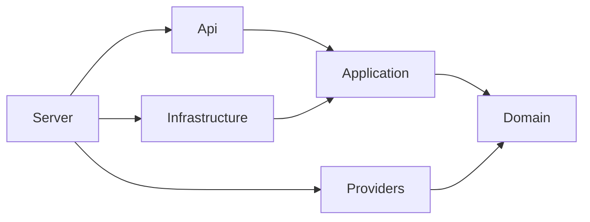

# Architecture

LLMProxy is a standalone ASP.NET Core gateway with reusable libraries. The composition root is `LLMProxy.Server`; all state needed across replicas lives in PostgreSQL and Redis. Standalone mode uses SQLite and process-local rate/cursor state for a single instance.

## Dependency direction



`Domain` contains entities, typed chat contracts, exceptions and interfaces. It references no EF Core, ASP.NET Core or provider SDK. `Application` owns policy and orchestration. `Infrastructure` implements persistence and distributed state. `Providers` translates between the common contract and provider wire protocols. `Api` owns HTTP-specific behavior, including authentication challenges, problem details and SSE framing.

`RuntimeCatalog` atomically publishes a validated model/pricing/provider snapshot. Route planning captures a generation and keeps provider objects and prices through settlement. Explicit reload changes these catalogs; process settings such as storage, listeners, workers and global limits require restart. Latency samples are local to each process; durable policy and accounting state are shared.

## Request flow

1. Generate a fresh internal request ID and validate an optional `X-Correlation-Id` header.
2. Parse the bearer key, hash it, look up its current policy or valid rotation credential, and compare hashes in constant time. Disabled/expired keys fail authentication. Update `LastUsedAt` after successful authentication.
3. Validate the chat request, model alias, allowed-model policy and output-token bounds.
4. Atomically acquire key, owner and model rate-limit allowances. Denial consumes none of the other scopes.
5. Filter available targets by adapter/model capabilities and feature combinations, then apply the routing strategy.
6. Acquire global/key/model concurrency leases and atomically reserve lifetime/monthly tokens and spending, conditional on current key policy.
7. Acquire a provider/account concurrency lease and invoke its HTTP resilience pipeline. Record individual attempts; move to another candidate only for a classified transient failure.
8. Translate the result back to the public alias and a stable gateway completion ID.
9. Atomically commit usage/attempts, settle the original quota period and release reservations and concurrency leases. Return the normal response or finish the SSE stream.

`GET /v1/models` shares key and owner rate limits but does not consume token quota. It returns only permitted aliases with at least one configured provider.

## Provider and routing contracts

```csharp
public interface ILlmProvider
{
    string Name { get; }
    bool IsConfigured { get; }
    ModelCapabilities Capabilities { get; }
    Task<LlmResponse> ChatCompletionAsync(LlmRequest request, CancellationToken cancellationToken);
    IAsyncEnumerable<LlmStreamChunk> StreamChatCompletionAsync(
        LlmRequest request, CancellationToken cancellationToken);
}
```

`IModelRouter.SelectProviderAsync` provides the simple selection contract. `IRoutePlanner` supplies the ordered compatible fallback plan. Strategies implement `IRoutingStrategy`; round-robin uses `IRoutingState` backed by Redis or local state. Priority preserves configuration order, random shuffles without replacement, and fallback forces fallback to remain enabled. Cost orders by the request estimate and captured prices. Latency orders by local EWMA completion/first-event measurements with periodic resampling and failure penalties.

To add a provider:

1. Implement `ILlmProvider` and declare adapter capabilities. Translate supported content, tool calls, usage and finish reasons into domain types. Implement `IProtocolProvider` for native embeddings or Responses.
2. Propagate cancellation and raise sanitized `ProviderException` values, marking only transient failures retryable. Never include raw upstream error bodies in exceptions.
3. Register the adapter as `ILlmProvider` and register a named resilient HTTP client if it uses `ProviderHttpTransport`.
4. Add provider/model mappings and pricing to configuration, with contract tests against a mock endpoint.

No router, business service or HTTP endpoint needs a provider-specific branch. Additional strategies can similarly be registered as `IRoutingStrategy` without changing `ModelRouter`.

Ten adapters are registered by default. OpenAI, Azure OpenAI, Foundry, Mistral, DeepSeek, Groq and Ollama share an OpenAI-compatible transport/parser with adapter overrides for endpoint, authentication, payload and response differences. Anthropic, Gemini and Cohere translate their native protocols. Foundry's optional `TokenCredential` and Azure.Identity dependency stay in the Providers project; application policy does not depend on Azure SDK types. [Provider behavior](providers.md).

## Retry and streaming behavior

`Microsoft.Extensions.Http.Resilience` provides attempt timeouts, retry with exponential backoff/jitter, `Retry-After` handling, a circuit breaker and a total HTTP timeout. Clients are named per provider/account; resilience pipelines are partitioned by endpoint authority and credential fingerprint so one key's circuit does not open another's. Redirects and cookies are disabled, preventing credentials from being forwarded to redirect targets.

The application uses a Polly resilience pipeline for provider fallback. HTTP 429, HTTP 408, 5xx failures and connection/timeout failures are retryable. `ProviderHttpTransport` selects from each account's optional `ApiKeys` pool before provider fallback. A pooled 401/403/429 cools that key and tries another; pooled 429s bypass same-key HTTP retries. Invalid requests fail immediately. Single-key authentication failures still fail immediately; exhausted multi-key authentication can fall back to another provider. POST retries can result in additional provider charges; cross-provider exactly-once billing cannot be guaranteed.

Key-pool cursors and cooldowns are atomic in Redis for PostgreSQL deployments and concurrency-safe in memory for standalone deployments. Redis server time determines cooldowns, and state is scoped to the actual account name. Each request visits an eligible key at most once, with its ordinary bounded HTTP retries. A single provider concurrency lease covers the entire selection/failover and any stream. The pool never retries a successful HTTP response, including a body read or stream that later fails. Attempts persist credential fingerprints without storing API keys. Catalog reload updates pool membership while retaining shared rotation/cooldowns; existing routes retain their credentials and captured prices. Dashboard-managed additions are encrypted with AES-256-GCM and stored separately from configuration overrides. A database revision synchronizes managed changes before authenticated HTTP inference and every five seconds for background work.

For streams, the application obtains the first provider event inside the fallback pipeline before committing HTTP 200. After an event is emitted, the stream is never replayed or switched to another provider. All chunks use the same public model name, ID and creation time. Usage is collected regardless of whether the client requests it, and emitted once as a final `choices: []` chunk when `include_usage` is true.

The OpenAI-compatible adapters check both a finish reason and `[DONE]`; Anthropic checks `message_stop`, Gemini checks final candidates and Cohere checks `message-end`. An incomplete stream is an error. Midstream errors produce a sanitized OpenAI error event and close without a successful `[DONE]` marker. A disconnected client cancels upstream work; cleanup uses an independent bounded cancellation token.

## Accounting and failure recovery

`ApiKey`, `QuotaReservation`, `QuotaWindow`, `UsageRecord` and `UpstreamAttempt` are persistent entities. Lifetime counters live on the key and UTC monthly counters in quota windows. Reservations retain their original month, including across month boundaries. Pruning usage does not reset allowances. Monetary counters use integer nano-USD; prices support ordinary/cached/created input and input-size tiers.

Pricing keys escape `%` and `:` for .NET configuration paths, allowing tagged model names such as `llama3.1:8b` without changing their upstream identifiers. This encoding belongs to configuration-backed pricing, not provider routing.

Before a request, the gateway estimates input tokens conservatively from UTF-8 bytes plus framing, adds the selected output cap, and reserves the most expensive candidate's estimated cost. This is an admission estimate, not a model-specific tokenizer. A small remaining token balance may require a lower `max_tokens` even for a short prompt.

The reservation update is one conditional SQL statement inside a transaction. PostgreSQL and SQLite tests verify that concurrent requests cannot reserve more than the available allowance. Completion claims and deletes the reservation, updates the counters and inserts usage in the same transaction. Duplicate finalizers do not charge twice. EF Core execution strategies retry database transactions with fresh contexts.

Successful responses use provider-reported usage and captured prices. Missing final usage is estimated and marked `usage_estimated`. Interrupted streams without final usage and cancelled/timed-out admitted requests are charged conservatively up to their reserved token ceiling. A known upstream rejection with no output is recorded with zero observed usage. `AttemptRecordingHandler` records individual HTTP sends inside retries, while gateway orchestration captures fallback attempts. Unknown attempt costs remain estimated. Invoice imports update request and lifetime/original-month spending atomically and idempotently by attempt and external reference. Spending remains an estimate until reconciled.

A recovery worker checks for expired reservations every minute. If a process exits before finalization, recovery records an `abandoned` request and consumes its reserved allowance. Expiry must exceed the full request deadline and cleanup window. Operators can investigate these records before performing any manual reconciliation. Reservations are never silently refunded after a crash.

Admitted chat, embeddings and Responses requests produce durable usage records. Rejections before admission produce HTTP telemetry and a separate audit event rather than completion rows. Management mutations receive intent and outcome audit events. Usage/audit and normal logs exclude prompts, responses and raw keys. Batch input/output storage intentionally retains content for later execution and download.

## Distributed state and consistency

- API-key authentication reads current database state; it does not cache policies, so revocations apply to subsequent authentications immediately.
- Redis rate-limit scripts check every scope before incrementing any counter. Windows last 60 seconds from each scope's first accepted request.
- Redis also caches round-robin cursors with a 24-hour expiry. A common hash tag keeps multi-key Lua operations in one Redis Cluster slot.
- Redis concurrency leases check all scopes atomically and expire after the request deadline plus a cleanup margin. Normal completion/disposal releases them immediately.
- Redis outages fail closed with HTTP 503. The gateway never quietly switches a distributed deployment to local limits.
- Key policies already authenticated or requests already in flight are not retroactively cancelled by revocation.
- PostgreSQL/Redis deployments can scale horizontally. SQLite mode is intended for one process and uses local limits that reset on restart.

## Management and batch workers

Operators have local password hashes and expiring hashed bearer sessions. Administrator/operator/auditor roles are enforced at HTTP endpoints; all replicas read current account/session state from the database. The dashboard is embedded in the API assembly and stores credentials only in browser memory. No SSO identity provider is bundled.

Files and batches belong to gateway key IDs, so credential rotation preserves access. Workers atomically claim items in the shared database and route them through ordinary admission/accounting. Stale running claims become explicit interrupted errors instead of being replayed. Maintenance finishes cancellation, expires pending work and prunes old content. Gateway batches do not use provider batch APIs or their discounted pricing. See the [extended API guide](expanded-api.md).
